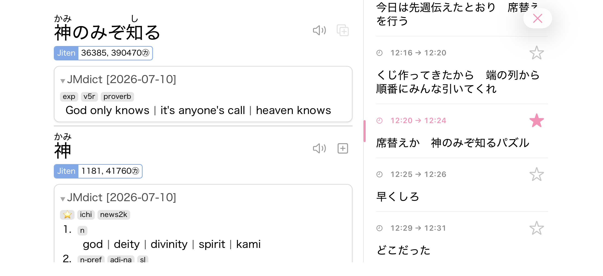
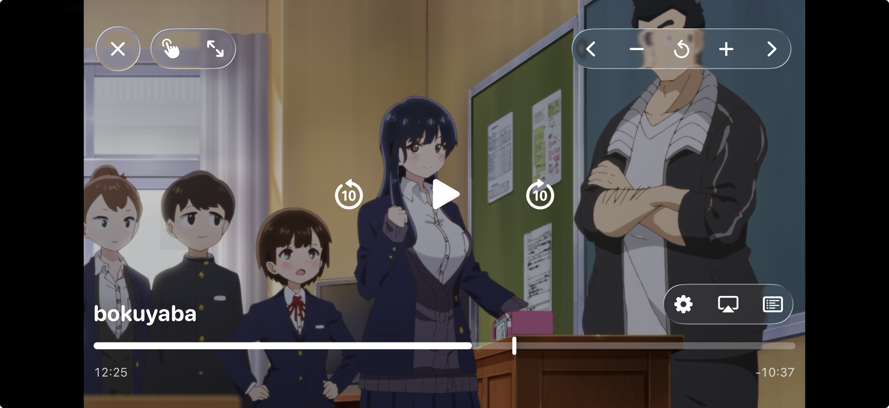
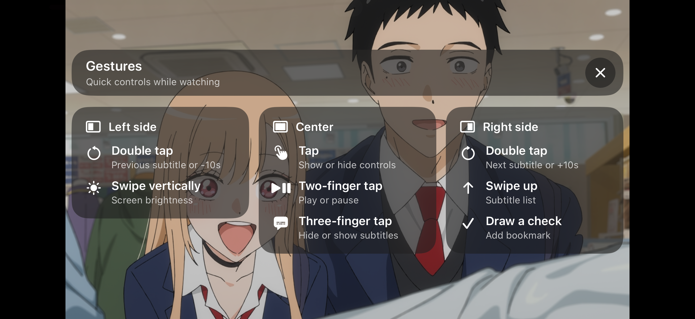

# Hana

Hana is an iOS video player built for watching, reading, and mining Japanese media. It combines local video playback, subtitle tools, dictionary lookup, and Anki-oriented media extraction in one SwiftUI app.

  

## Download

Hana is currently available as a TestFlight beta:

The app is still under early development. Feedback and bug reports are welcome, but pull requests are not being accepted at this stage while the architecture and product direction are still settling.

## Screenshots

### Library

   
  Browse local videos and continue watching.

### Playback and Study

<table>
  <tr>
    <td align="center" width="33%">
       
      Inspect subtitle lines while staying close to playback.
    </td>
    <td align="center" width="33%">
       
      Control playback without losing sight of the video.
    </td>
    <td align="center" width="33%">
       
      Use playback gestures for video-first controls.
    </td>
  </tr>
</table>

## Features

- Local video playback with subtitle-focused controls
- Continue-watching history for recent videos
- Subtitle selection, subtitle list browsing, and dictionary lookup
- Custom subtitle server support
- Anki-oriented mining helpers for screenshots and audio clips
- iOS 26 Liquid Glass-style player controls
- HoshiReader dictionary integration
- WebDAV media source support (in development)

## Requirements

- iOS 26 or newer
- Xcode 26 or newer for local development
- Swift 6.3 toolchain

## Development

1. Clone the repository.
2. Open `Hana.xcodeproj` in Xcode.
3. Select the `Hana` scheme.
4. Build and run on an iOS 26+ simulator or device.

This repository is currently early-stage. Issues and feedback are useful, but PRs are not accepted for now.

## Dependencies

Hana includes several media, dictionary, and app-support libraries. The in-app About page mirrors these notices.

### Playback Libraries

| Name | Description | License |
| --- | --- | --- |
| [SwiftVLC](https://github.com/harflabs/SwiftVLC) | Swift wrapper around libVLC. Hana currently uses the upstream static package for testing and should use the [dynamic LGPL fork](https://github.com/harukawu/SwiftVLC/tree/lgpl) for distribution. | MIT |
| [libVLC](https://www.videolan.org/vlc/) | Native VLC playback engine used through SwiftVLC. Release builds should keep the shipped binary, license text, and matching source offer aligned. | LGPL-2.1-or-later |
| [FFmpeg-iOS](https://github.com/harukawu/FFmpeg-iOS/tree/lgpl) | Hana fork of [kewlbear/FFmpeg-iOS](https://github.com/kewlbear/FFmpeg-iOS), rebuilt for dynamically linked LGPL libraries. | LGPL-2.1 |
| [FFmpeg](https://ffmpeg.org/legal.html) | Native FFmpeg libraries used through FFmpeg-iOS. This software uses libraries from the FFmpeg project under the LGPLv2.1. | LGPL-2.1-or-later |
| [FFmpeg-iOS-Support](https://github.com/kewlbear/FFmpeg-iOS-Support) | Support package used by FFmpeg-iOS for platform hooks and linked system frameworks. | LGPL-2.1 |

### App Dependencies

| Name | Description | License |
| --- | --- | --- |
| [PersistedObservation](https://github.com/harukawu/PersistedObservation) | Swift macro package written for Hana. | MIT |
| [MarqueeText](https://github.com/harflabs/MarqueeText) | Scrolling text used by the file browser UI. | MIT |
| [SWXMLHash](https://github.com/drmohundro/SWXMLHash) | XML parsing used by WebDAV support. | MIT |

### HoshiReader Package Dependencies

Hana uses the dictionary portion of a SwiftPM package fork of [Manhhao/Hoshi-Reader](https://github.com/Manhhao/Hoshi-Reader): [harukawu/Hoshi-Reader, `hana-package`](https://github.com/harukawu/Hoshi-Reader/tree/hana-package). The package currently includes reader and EPUB-related dependencies even though Hana's UI focuses on dictionary features.

| Name | Description | License |
| --- | --- | --- |
| [HoshiReader](https://github.com/harukawu/Hoshi-Reader/tree/hana-package) | Dictionary, reader, and Anki-related code imported as a SwiftPM package. | GPL-3.0 |
| [hoshidicts](https://github.com/Manhhao/hoshidicts) | Dictionary engine used by HoshiReader. | GPL-3.0 |
| [EPUBKit](https://github.com/witekbobrowski/EPUBKit) | Vendored by HoshiReader. | MIT |
| [AEXML](https://github.com/tadija/AEXML) | EPUBKit XML dependency. | MIT |
| [ZIPFoundation](https://github.com/weichsel/ZIPFoundation) | EPUBKit ZIP dependency. | MIT |
| [SwiftUI Introspect](https://github.com/siteline/SwiftUI-Introspect) | SwiftUI introspection dependency used by HoshiReader. | MIT |
| [libdeflate](https://github.com/ebiggers/libdeflate) | Compression dependency included by hoshidicts. | MIT |
| [utf8proc](https://github.com/JuliaStrings/utf8proc) | Unicode processing dependency included by hoshidicts. Its license file also covers derived Unicode data. | MIT/Unicode |
| [utfcpp](https://github.com/nemtrif/utfcpp) | UTF C++ helper included by hoshidicts. | BSL-1.0 |
| [glaze](https://github.com/stephenberry/glaze) | JSON/C++ serialization dependency included by hoshidicts. | MIT |
| [xxHash](https://github.com/Cyan4973/xxHash) | Hashing dependency included by hoshidicts. | BSD-2-Clause |
| [unordered_dense](https://github.com/martinus/unordered_dense) | Hash map dependency included by hoshidicts. | MIT |
| [zstd](https://github.com/facebook/zstd) | Compression dependency used by hoshidicts. | BSD-3-Clause |
| [kanji-processor](https://github.com/yomidevs/kanji-processor) | Data embedded by hoshidicts for kanji variant normalization. | MIT |

### Build Tools

| Name | Description | License |
| --- | --- | --- |
| [SwiftSyntax](https://github.com/swiftlang/swift-syntax) | Used by the PersistedObservation macro implementation. | Apache-2.0 |
| [Swift Argument Parser](https://github.com/apple/swift-argument-parser) | Resolved by FFmpeg-iOS for its command-line tool target. | Apache-2.0 |

## Attribution

| Name | Description | License |
| --- | --- | --- |
| [Ankiconnect Android](https://github.com/KamWithK/AnkiconnectAndroid) | HoshiReader attribution for local audio and Anki-related behavior. | GPL-3.0 |
| [Yomitan](https://github.com/yomidevs/yomitan) | HoshiReader attribution for pop-up dictionary behavior and related ideas/code. | GPL-3.0 |
| [ttu Reader](https://github.com/ttu-ttu/ebook-reader) | HoshiReader attribution for reader statistics inspiration/code. | BSD-3-Clause |
| [JMdict for Yomitan](https://github.com/yomidevs/jmdict-yomitan) | Recommended term dictionary source. | CC-BY-SA-4.0 |
| [Jiten](https://github.com/Sirush/Jiten) | Recommended frequency dictionary source. | Apache-2.0 |
| [Kanji alive](https://github.com/kanjialive/kanji-data-media) | HoshiReader default audio/data attribution. | CC-BY-4.0 |
| [Tofugu/WaniKani Audio](https://github.com/tofugu/japanese-vocabulary-pronunciation-audio) | HoshiReader default audio attribution. | CC-BY-SA-4.0 |

## Contributing

Hana is in early development and pull requests are currently not accepted. If you are testing the app, please report bugs, crashes, and confusing workflows through the channel where you received the beta.

## Special Thanks

- [Manhhao/Hoshi-Reader](https://github.com/Manhhao/Hoshi-Reader) and its authors for the dictionary and reader foundation.
- The [FFmpeg](https://ffmpeg.org/) and [VideoLAN](https://www.videolan.org/) projects for the media engine pieces.
- Everyone testing Hana through TestFlight.

## License

Hana is licensed under the GNU General Public License v3.0. See [LICENSE](LICENSE).

Hana also uses LGPL media libraries. Distribution builds should preserve the required FFmpeg and libVLC notices, source offers, and dynamic-linking compliance path.
